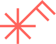

    

        

            
            <h1 class="display-5 fw-bold text-body-emphasis lh-1 mb-0">¿Qué es casafaro?</h1>
        

        
Somos una organización dedicada a transformar las relaciones humanas, institucionales y sociales, impulsando la creación de entornos más conscientes, pacíficos y sostenibles. Casafaro busca contribuir al bienestar de la vida colectiva en cada una de sus dimensiones, al fortalecer comunidades que se conectan y se cuidan.

    

    

        
    
  

    

       
 
            
        <h1 class="display-5 fw-bold text-body-emphasis lh-1 mb-0">¿Qué hacemos?</h1>
    

    

        
        <h2 class="fw-normal">Acompañamos</h2>
        
Construimos intervenciones hechas a la medida, de la mano con instituciones, equipos o comunidades para revisar prácticas, vínculos y culturas relacionales.
        Brindamos herramientas para facilitar procesos de diálogo, reflexión y transformación que promuevan el bienestar organizacional y comunitario.

    

    <!-- /.col-lg-4 -->
    

         
        <h2 class="fw-normal">Lab de ideas y acción</h2>
        
Bajo un modelo laboratorio de ideas y acción, investigamos, diseñamos y probamos metodologías y herramientas innovadoras y creativas que nos acerquen a entender y fortalecer las relaciones humanas e institucionales.  Documentamos los aprendizajes, dando valor a la experiencia y generando evidencia para incidir en políticas, programas o modelos organizacionales.

    

    <!-- /.col-lg-4 -->
    

        
        <h2 class="fw-normal">Informamos</h2>
        
En nuestra Academia, desarrollamos capacidades humanas, técnicas y éticas en materia de cuidados, corresponsabilidad, liderazgo consciente, gestión de vínculos, relaciones de género y transformación cultural-institucional.  Compartimos  estos datos y experiencias, de manera accesible, para que más personas e instituciones puedan incorporarlos en su práctica y contribuir a entornos más humanos y resilientes.

    

    <!-- /.col-lg-4 -->

    

       
 
            
            <h1 class="display-5 fw-bold text-body-emphasis lh-1 mb-0">¿Quiénes somos?</h1>
        

    
 

       

    

        
        <h2 class="fw-normal rojocf">Fabiola</h2>
        
Directora de política y justicia social

    

    <!-- /.col-lg-3 -->
    

        
        <h2 class="fw-normal rojocf">Fernando</h2>
        
Director de bienestar y salud mental

    

    <!-- /.col-lg-3 -->
    

        
        <h2 class="fw-normal rojocf">Melissa</h2>
        
Directora de tecnología y sociedad

    

    <!-- /.col-lg-3 -->
    

        
        <h2 class="fw-normal rojocf">Victor</h2>
        
Director de género y paz

    

    <!-- /.col-lg-3 -->

    

       
 
            
            <h1 class="display-5 fw-bold text-body-emphasis lh-1 mb-0">Contáctanos</h1>
        

    
 
    

        

            
            <a href="mailto:hola@casafaro.onmicrosoft.com" class="lead text-body-emphasis">hola@casafaro.onmicrosoft.com</a>
        

    
 

  

