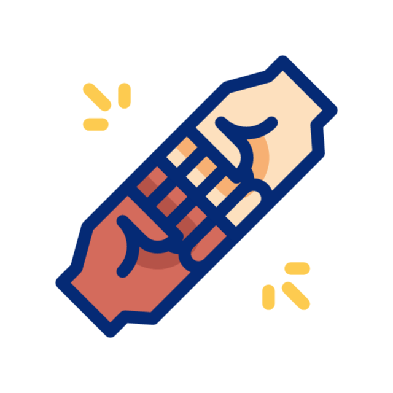
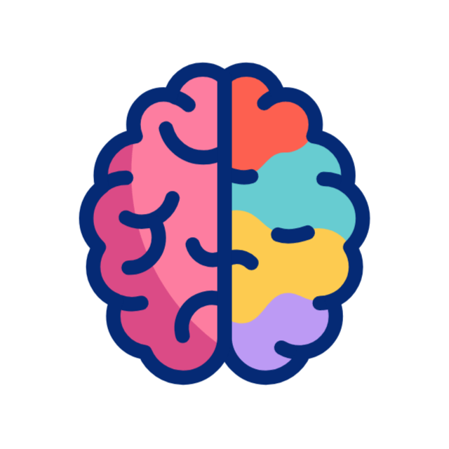

    

        

            
            <h1 class="display-5 fw-bold text-body-emphasis lh-1 mb-0">¿Qué hacemos?</h1>
        

    

    

        
        <h2 class="fw-normal">Acompañamos</h2>
        
Construimos intervenciones hechas a la medida, de la mano con instituciones, equipos o comunidades para revisar prácticas, vínculos y culturas relacionales.
        Brindamos herramientas para facilitar procesos de diálogo, reflexión y transformación que promuevan el bienestar organizacional y comunitario.

        

            <a class="btn btn-secondary" href="#">View details &raquo;</a>
        

    

    <!-- /.col-lg-4 -->
    

         
        <h2 class="fw-normal">Lab de ideas y acción</h2>
        
<i class="fa-solid fa-people-robbery"></i>Bajo un modelo laboratorio de ideas y acción, investigamos, diseñamos y probamos metodologías y herramientas innovadoras y creativas que nos acerquen a entender y fortalecer las relaciones humanas e institucionales.  Documentamos los aprendizajes, dando valor a la experiencia y generando evidencia para incidir en políticas, programas o modelos organizacionales.

        

            <a class="btn btn-secondary" href="#">View details &raquo;</a>
        

    

    <!-- /.col-lg-4 -->
    

        
        <h2 class="fw-normal">Informamos</h2>
        
En nuestra Academia, desarrollamos capacidades humanas, técnicas y éticas en materia de cuidados, corresponsabilidad, liderazgo consciente, gestión de vínculos, relaciones de género y transformación cultural-institucional.  Compartimos  estos datos y experiencias, de manera accesible, para que más personas e instituciones puedan incorporarlos en su práctica y contribuir a entornos más humanos y resilientes.

        

            <a class="btn btn-secondary" href="#">View details &raquo;</a>
        

    

    <!-- /.col-lg-4 -->

    

        

            
            <h1 class="display-5 fw-bold text-body-emphasis lh-1 mb-0">El cumplimiento normativo es el punto de partida... no el destino</h1>
        

    

    

        
Cumplir con la norma es apenas el inicio. En CasaFaro acompañamos a las organizaciones a ir más allá del checklist: transformamos el cumplimiento normativo en cultura, convirtiendo políticas de género, derechos humanos, anticorrupción y ética en prácticas vivas que construyen confianza interna y legitimidad pública.

    

    

        

            
            <h1 class="display-5 fw-bold text-body-emphasis lh-1 mb-0">Porque quienes cuidan también necesitan cuidados</h1>
        

    

    

        
Quienes sostienen la vida —en equipos, instituciones, familias y comunidades— también necesitan ser cuidados. Trabajamos para que el cuidado sea recíproco y sostenible: diseñamos intervenciones que cuidan a las personas cuidadoras, para que los equipos florezcan y las organizaciones se fortalezcan.

    

